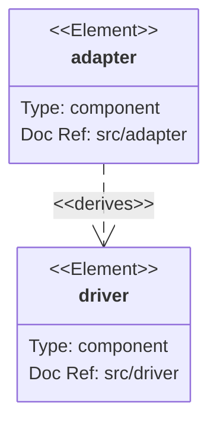
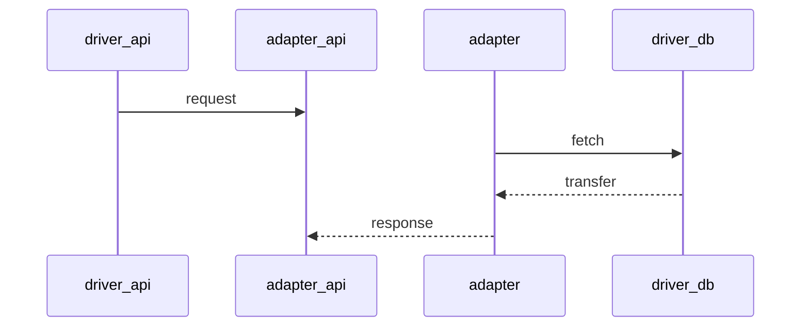

# scraper

Online scraper for building a dataset for ML.

## License

If share pictures, they must be with https://creativecommons.org/licenses/by-sa/2.0/

## installation

VSCode and Docker

## Run

Run first localstack and then backend in different terminals

#### localstack
```shell
docker network create scraper-net; docker run --rm -it --net scraper-net --name scraper-localstack --network-alias localstack localstack/localstack
```
#### Run backend with docker
```shell
docker rmi scraper-backend; docker build -t scraper-backend .; docker run --read-only --rm -it --net scraper-net --name scraper-backend --network-alias backend -p 8080:8080 --env-file .devcontainer/devcontainer.env scraper-backend
```

#### Run backend without docker (devcontainer)
```shell
go run src/main.go
```

## Build
```shell
go build -o scraper src/main.go
./scraper
```

#### Devcontainer

```
CLOUD_HOST=localstack
LOCALSTACK_URI=http://scraper-localstack:4566
COMMON_NAME=scraper-backend-test

FLICKR_PRIVATE_KEY=***
FLICKR_PUBLIC_KEY=***
UNSPLASH_PRIVATE_KEY=***
UNSPLASH_PUBLIC_KEY=***
PEXELS_PUBLIC_KEY=***

AWS_REGION=us-west-1
AWS_PROFILE=KookaS
AWS_ACCESS_KEY=***
AWS_SECRET_KEY=***
```

CLOUD_HOST is either `aws`, `localstack`

# Github

Repo secrets:
- FLICKR_PRIVATE_KEY
- FLICKR_PUBLIC_KEY
- GH_INFRA_TOKEN
- PEXELS_PUBLIC_KEY
- UNSPLASH_PRIVATE_KEY
- UNSPLASH_PUBLIC_KEY

Environment secrets:
- AWS_ACCESS_KEY
- AWS_SECRET_KEY

Environment variables:
- AWS_REGION
- AWS_ACCOUNT_ID
- AWS_PROFILE

# Code

## Interfaces

The database requires the following interface:

```go
type MyModel interface{
    Scan(value interface{}) error
    Value() (driver.Value, error)
}
```

The gin router requires the following interface:

```go
    MarshalJSON() ([]byte, error) 
    UnmarshalJSON(data []byte) error
```

## Architecture levels

Usecases are applications-specific business rules, here the detector.
Adapters converts data from usecase to drivers.
Drivers are glue code that communicates to the next level.

https://mermaid-js.github.io/mermaid/#/



In a typical request:

