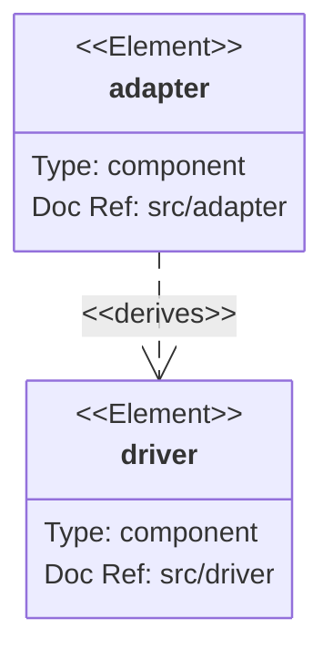
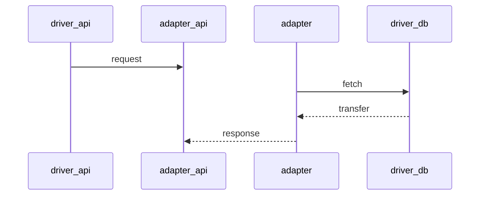

# scraper

Online scraper for building a dataset for ML.

## installation

VSCode and Docker

## Run

Run in devcontainer the backend and spawn in an other terminal localstack.

```shell
# network
docker network create scraper-net
docker network ls

# docker images
docker run --rm -it --net scraper-net --name scraper-localstack --network-alias localstack localstack/localstack
```

To check the tables with aws cli:
    
```shell
aws --endpoint-url=http://scraper-localstack:4566 dynamodb describe-table --table-name scraper-backend-test-pictureProcess
aws dynamodb scan --endpoint-url=http://scraper-localstack:4566 --table-name scraper-backend-test-pictureProcess
```

#### Backend with Docker
```shell
sudo docker build -t scraper-backend .
sudo docker run --rm -it --net scraper-net --name scraper-backend --network-alias backend --env-file .devcontainer/devcontainer.env scraper-backend
```

#### Backend without docker
    go run src/main.go

## Build

    go build -o scraper src/main.go
    ./scraper

## License

must share photos generated with https://creativecommons.org/licenses/by-sa/2.0/

## Env

Create a local.env file:

    CLOUD_HOST=localstack
    URL_LOCALSTACK=http://scraper-localstack:4566
    COMMON_NAME=scraper-backend-test
    
    FLICKR_PRIVATE_KEY=***
    FLICKR_PUBLIC_KEY=***
    UNSPLASH_PRIVATE_KEY=***
    UNSPLASH_PUBLIC_KEY=***
    PEXELS_PUBLIC_KEY=***
    
    AWS_REGION=us-east-1
    AWS_PROFILE=dummy
    AWS_ACCESS_KEY=dummy
    AWS_SECRET_KEY=dummy

CLOUD_HOST is either `aws`, `localstack`

## linter

https://github.com/mgechev/revive

    revive -config revive.toml

## Dependencies

    go mod tidy

## Interfaces

The database requires the following interface:

```go
type MyModel interface{
    Scan(value interface{}) error
    Value() (driver.Value, error)
}
```

The gin router requires the following interface:

```go
    MarshalJSON() ([]byte, error) 
    UnmarshalJSON(data []byte) error
```

## Architecture levels

Usecases are applications-specific business rules, here the detector.
Adapters converts data from usecase to drivers.
Drivers are glue code that communicates to the next level.

https://mermaid-js.github.io/mermaid/#/



In a typical request:

