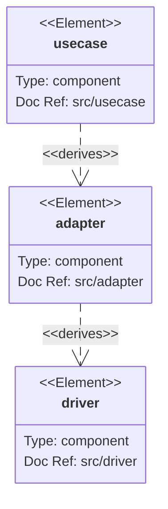
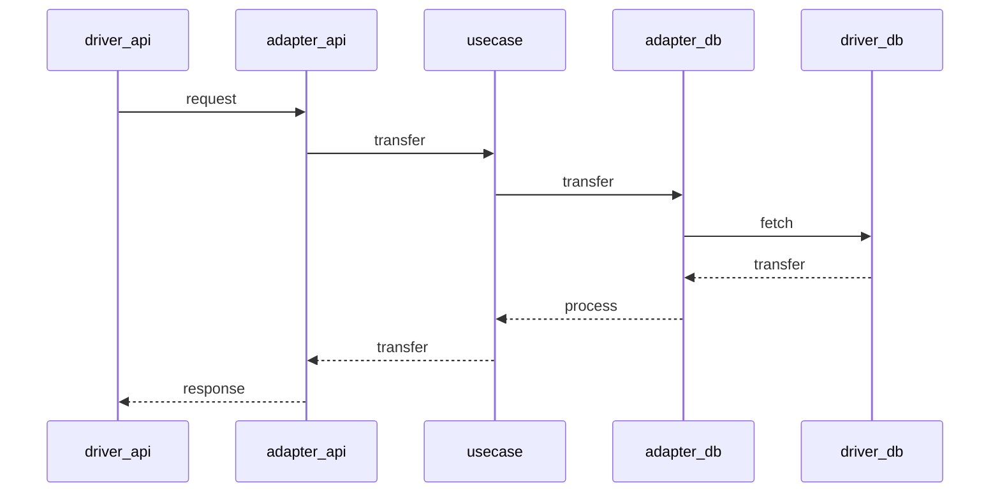

# scraper

Online scraper for building a dataset for ML.

## installation

VSCode and Docker

## Run

Run in devcontainer the backend and spawn in other terminals the localstack and mongodb.

- ***Create network for docker*** (otherwise it will fail)
- MongoDB
- Localstack
- Backend

```shell
# network
docker network create scraper-net
docker network ls

# docker images
docker run --rm -it --net scraper-net --name scraper-localstack localstack/localstack
docker run --rm -it --net scraper-net --name scraper-mongodb mongo:6.0.1

# To test the connection, should not throw an error
curl --connect-timeout 10 --silent --show-error scraper-mongodb:27017
curl --connect-timeout 10 --silent --show-error scraper-localstack:4566
```

#### Backend with Docker
```shell
sudo docker build -t scraper-img .
sudo docker run --rm -it --net scraper-net --name scraper-run --env-file <state>.env scraper-img
```

#### Backend without docker
    go run src/main.go

## Build

    go build -o scraper src/main.go
    ./scraper

## License

must share photos generated with https://creativecommons.org/licenses/by-sa/2.0/

## Env

Create a local.env file:

    CLOUD_HOST=localstack
    URL_LOCALSTACK=http://scraper-localstack:4566
    IMAGES_BUCKET=scraper-backend-local-env

    TABLE_PICTURE_NAME=***
    TABLE_PICTURE_PK=origin
    TABLE_PICTURE_SK=name
    TABLE_TAG_NAME=***
    TABLE_TAG_PK=type
    TABLE_TAG_SK=name
    TABLE_USER_NAME=***
    TABLE_USER_PK=origin
    TABLE_USER_SK=name

    FLICKR_PRIVATE_KEY=***
    FLICKR_PUBLIC_KEY=***
    UNSPLASH_PRIVATE_KEY=***
    UNSPLASH_PUBLIC_KEY=***
    PEXELS_PUBLIC_KEY=***

CLOUD_HOST is either `aws`, `localstack`

## linter

https://github.com/mgechev/revive

    revive -config revive.toml

## Dependencies

    go mod tidy

## Architecture levels

Usecases are applications-specific business rules, here the detector.
Adapters converts data from usecase to drivers.
Drivers are glue code that communicates to the next level.

https://mermaid-js.github.io/mermaid/#/



In a typical request:

